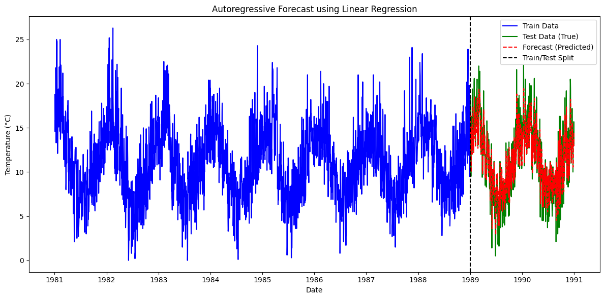

1. model performance:
    it has recieved an RMSE of 2.369 meaning the model's prediction deviate from the actual temperature by about 2.4°C.

2. the seasonal patterns are roughly maintained in the forecast. But it can be seen that the maximum temperatures forecasted is lower than the test data. The same can also be observed in case of winter, it forecasted temperature which is higher than the original one.

image:

