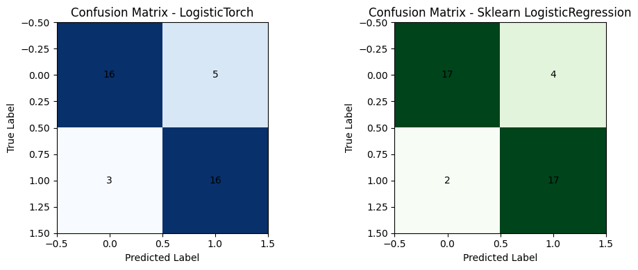
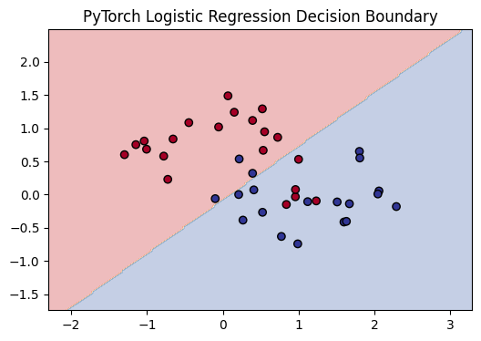
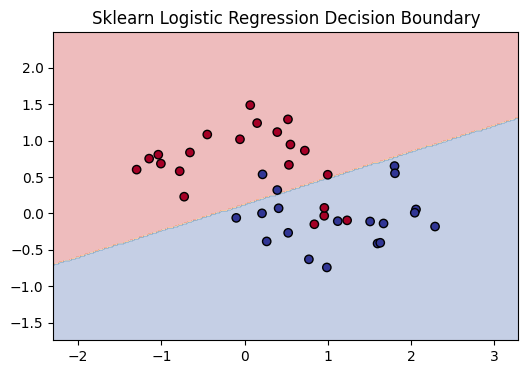
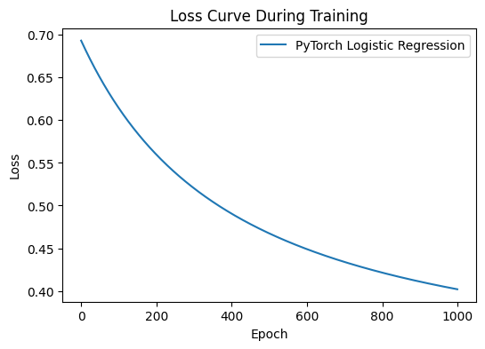

1. Logistic Regression which supports the given functions is implemented using pytorch.

2. The LogisticTorch classifier is trained on make_moons dataset. Same is also done with sklearn.linear_model.LogisticRegression.

Their performances are compared as follows:

LogisticTorch
Accuracy : 0.800
Precision: 0.762
Recall   : 0.842
F1 Score : 0.800

Sklearn LogisticRegression
Accuracy : 0.850
Precision: 0.810
Recall   : 0.895
F1 Score : 0.850

3. decision boundary plots

4. loss curve for LogisticTorch

